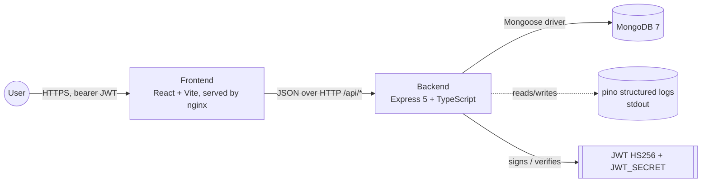
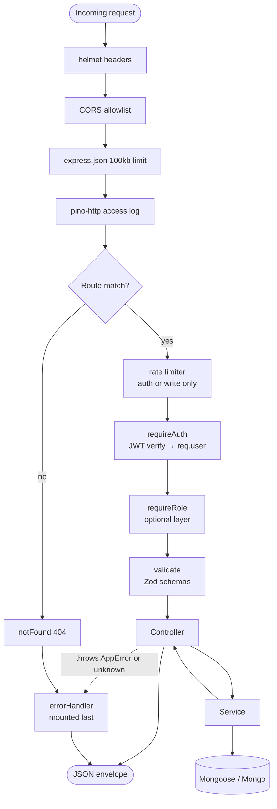
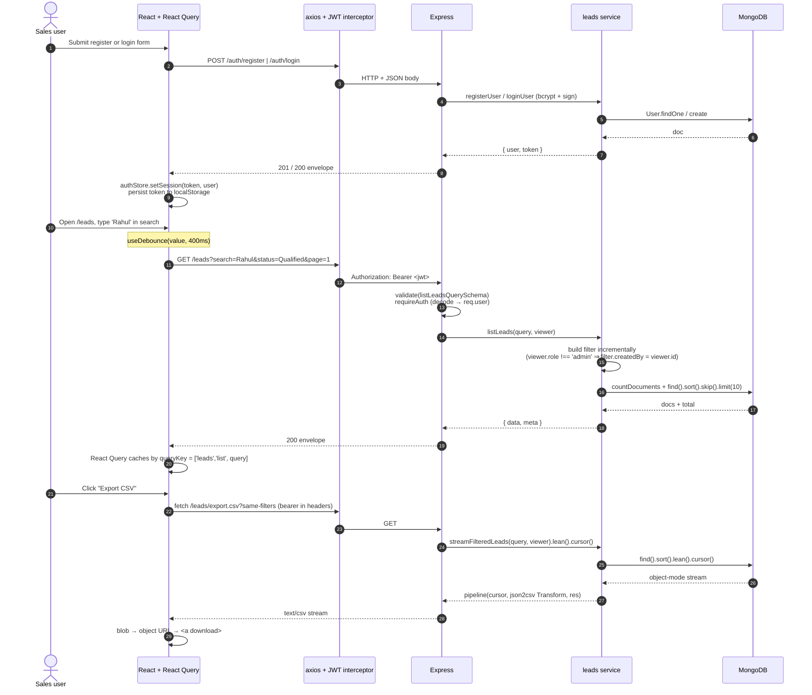
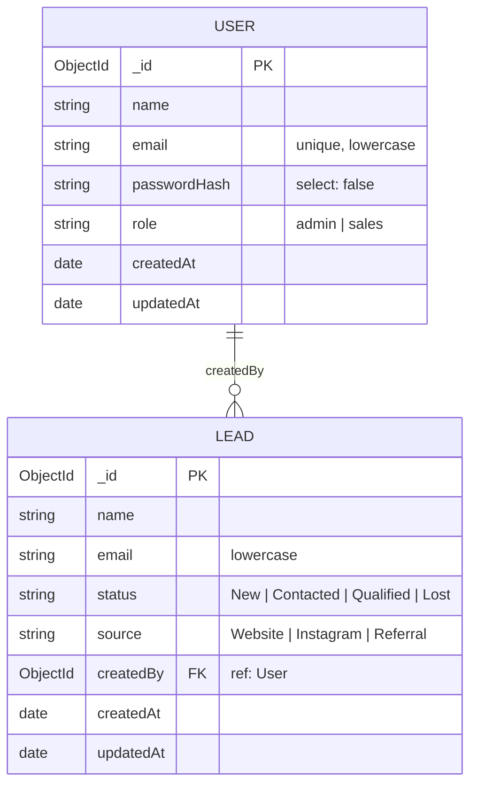

# Architecture

How Leadsrack is wired together. Reading order: system context → request pipeline → primary-workflow sequence → data model → known limitations.

## System context



Three runtime services in compose: `web`, `api`, `mongo`. Frontend talks to backend only through `/api/*` — in production that path is proxied by nginx; in local dev the client hits the API origin directly via `VITE_API_URL`.

## Request pipeline (API)



Mounting order is enforced in [`Backend/src/app.ts`](Backend/src/app.ts):

```
helmet → cors → json → pino-http → /api router → notFound → errorHandler
```

`errorHandler` is last so any `next(err)` flows through it. `AppError` maps to a structured `{ error: { code, message, details? } }` envelope; unknown errors get a generic 500.

## Primary workflow — Sales user creates and filters leads



Every authenticated request shares the same middleware order: `requireAuth` first, then any `requireRole(...)` layer, then `validate({ body, query, params })`, then controller. Errors bubble to a single `errorHandler` at the end of the chain.

## Data model



Indexes:

- `User.email` — unique.
- `Lead.createdBy` — single-field (filter for sales users).
- `Lead.status` and `Lead.source` — single-field (frequent filters).
- `Lead.{createdBy:1, createdAt:-1}` — compound (covers the sales-user list query pattern).
- `Lead.{name:'text', email:'text'}` — text index (kept for future full-text upgrade; current search uses escaped regex for partial matches).

## Known limitations

- **Type drift** between Backend Zod schemas (the source of truth) and Frontend interfaces (`Frontend/src/types/api.ts`). Mitigated by the small entity count (2) and CI lint+typecheck on both sides. Future improvement: introduce `packages/shared` — see [ADR 0001](docs/ADRs/0001-no-monorepo-tooling.md).
- **Token in localStorage** is XSS-exposed. Trade-off documented in [ADR 0005](docs/ADRs/0005-token-in-localstorage.md); CSP and httpOnly-cookie migration in the roadmap.
- **No refresh tokens**. The access token simply expires after `JWT_EXPIRES_IN`; the user is forced to log in again.
- **CSV export memory** scales linearly with the export size. Streaming via `pipeline(cursor, json2csv, res)` keeps memory flat; however, very wide filter sets on admin accounts hit the database hard. Mitigation: future improvement is to gate exports beyond N rows with a job queue.
- **No tests**. Smoke-only via `pnpm build` in CI. Adding Vitest is in the roadmap and would slot into both workspaces without restructuring.
- **No observability** (Sentry/OTel). Logs are stdout-only.
- **Dark mode** applies to the auth and leads pages; the dashboard page is brand-themed dark in both modes.

## Evolution paths

- Add `packages/shared/` (Zod schemas + inferred types + API path constants) and migrate both apps to consume it. This eliminates the manual type mirror and the drift risk.
- Replace localStorage JWT with httpOnly refresh-token cookies + short-lived access JWT in memory. Add CSRF token for cookie-based auth.
- Introduce a job queue (BullMQ + Redis) for the CSV export to remove the synchronous response constraint.
- Add Sentry + OpenTelemetry hooks at the error handler and the pino logger.
