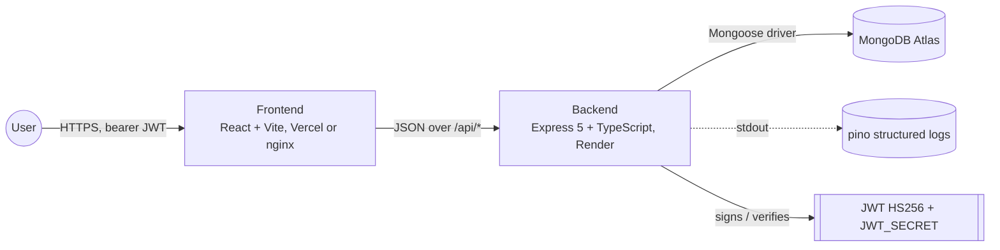
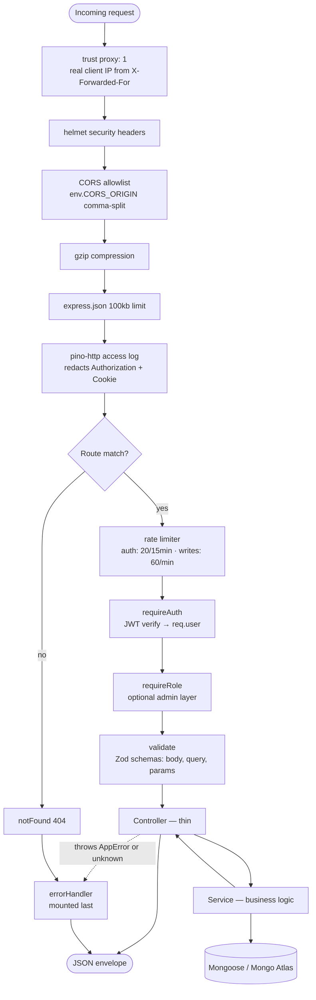
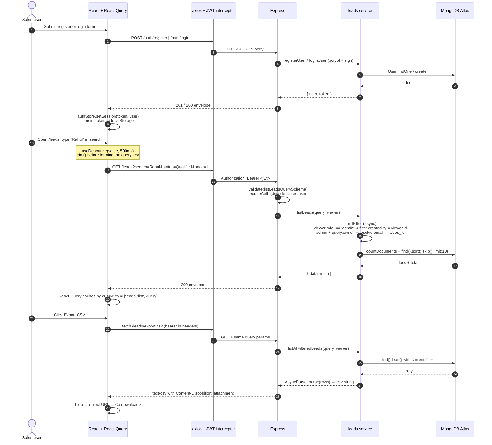
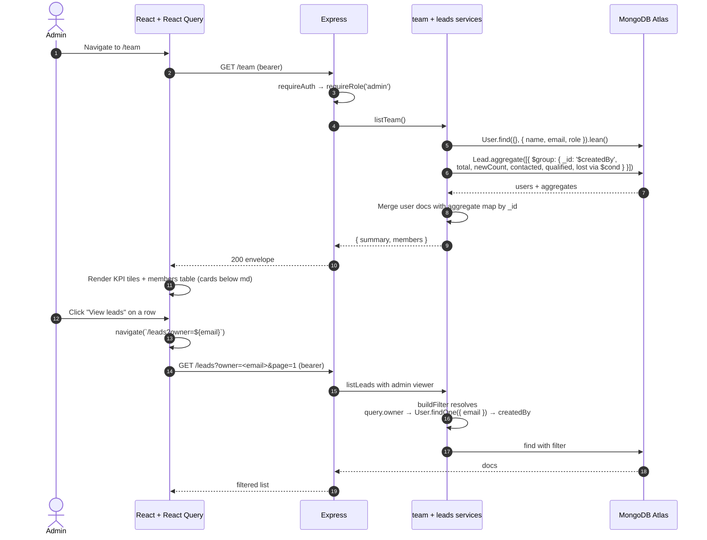
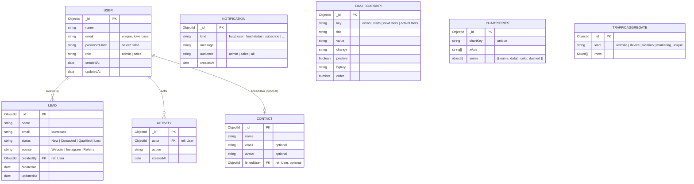

# Architecture

How Leadsrack is wired together. Reading order: system context → request pipeline → primary-workflow sequence → data model → known limitations.

## System context



Three runtime services in the local Docker compose stack (`web`, `api`, `mongo`); production splits them across **Vercel** (web), **Render** (api), and **MongoDB Atlas** (db). Frontend talks to backend only through `/api/*` — in production via the configured `VITE_API_URL`; in compose-only setups, nginx proxies `/api` to the api service.

## Request pipeline (API)



Mounting order is enforced in [Backend/src/app.ts](Backend/src/app.ts):

```text
helmet → cors → compression → json → pino-http → /api router → notFound → errorHandler
```

`errorHandler` is last so any `next(err)` flows through it. `AppError` maps to a structured `{ error: { code, message, details? } }` envelope; unknown errors get a generic `500 INTERNAL`.

## Primary workflow — Sales user creates and filters leads



Every authenticated request shares the same middleware order: `requireAuth` first, then any `requireRole(...)` layer, then `validate({ body, query, params })`, then controller. Errors bubble to a single `errorHandler` at the end of the chain.

## Admin workflow — Team page + per-user drill-in



Sales users hitting `/team` get `403 FORBIDDEN` from `requireRole('admin')`. Sales users passing `?owner=...` to `/leads` get their owner silently ignored — their own `createdBy = viewer.id` line wins inside `buildFilter`.

## Dashboard read-API workflow

```mermaid
sequenceDiagram
  participant UI as Dashboard widgets
  participant API as Express
  participant DB as MongoDB Atlas

  UI->>API: GET /dashboard/overview (bearer)
  API->>API: requireAuth
  par 3 parallel queries
    API->>DB: DashboardKpi.find().sort({ order: 1 })
  and
    API->>DB: ChartSeries.findOne({ chartKey: 'userChart' })
  and
    API->>DB: TrafficAggregate.find()
  end
  DB-->>API: results
  API-->>UI: { kpis, userChart, trafficByWebsite, trafficByDevice,<br/>trafficByLocation, marketingMonthly }

  Note over UI: Right drawer fans out three more reads:<br/>useNotifications() + useActivities() + useContacts()
  par 3 parallel queries
    UI->>API: GET /notifications (role-scoped audience filter)
    UI->>API: GET /activities (populate actor name/email/role; limit 20)
    UI->>API: GET /contacts (populate linkedUser; alphabetical)
  end
```

All dashboard collections are seeded by `pnpm seed` and are intentionally read-only at the application layer — they're updated via the seed script, not user actions.

## Data model



Indexes:

- `User.email` — unique.
- `Lead.createdBy` — single-field (filter for sales users).
- `Lead.status` and `Lead.source` — single-field (frequent filters).
- `Lead.{createdBy:1, createdAt:-1}` — compound (covers the sales-user list query pattern).
- `Lead.{name:'text', email:'text'}` — text index (kept for future full-text upgrade; current search uses escaped regex for partial matches).
- `Activity.{createdAt:-1}` — recent-first sort.
- `Activity.actor` — for populate joins.
- `Contact.{name:1}` — alphabetical list.
- `Contact.linkedUser` — for populate joins.
- `Notification.{audience:1, createdAt:-1}` — role-scoped feed.
- `ChartSeries.chartKey` — unique.
- `TrafficAggregate.kind` — unique (one document per kind).
- `DashboardKpi.key` — unique.

In production `autoIndex: false` is set on Mongoose — these are not auto-synced on boot; create them manually via Atlas or `db.collection.createIndexes()` after the first deploy.

## Known limitations

- **Type drift** between Backend Zod schemas (the source of truth) and Frontend interfaces ([Frontend/src/types/](Frontend/src/types/)). Mitigated by CI lint+typecheck on both sides. pnpm workspaces are in place (see [ADR 0006](docs/ADRs/0006-pnpm-workspaces.md)); next step is to add a `packages/shared` workspace for the schemas.
- **Token in localStorage** is XSS-exposed. Trade-off documented in [ADR 0005](docs/ADRs/0005-token-in-localstorage.md); CSP and httpOnly-cookie migration in the roadmap.
- **No refresh tokens**. The access token simply expires after `JWT_EXPIRES_IN`; the user re-logs in.
- **CSV export is array-based** (`Lead.find().lean()` → `AsyncParser.parse(rows)`). Bounded by available heap. Mitigation: switch to `.cursor()` + stream Transform for unbounded exports; gate beyond N rows with a job queue.
- **In-memory rate limiter**. Multi-dyno deployments need a shared store (`rate-limit-redis`).
- **No tests**. Smoke-only via `pnpm build` in CI. Vitest is in the roadmap; would slot into both workspaces without restructuring.
- **No observability** (Sentry/OTel). Logs are stdout only — Render captures them; for richer pipelines, add a pino transport.
- **Dashboard data is seeded, not user-driven**. The KPI/chart/traffic collections update only when `pnpm seed` re-runs. Treat them as demo content; a real product would compute them from leads + events.

## Evolution paths

- **`packages/shared/`** (Zod schemas + inferred types + API path constants) and migrate both apps to consume it. Eliminates the manual type mirror.
- **httpOnly refresh-token cookies + short-lived access JWT in memory**. Add CSRF token for cookie-based auth.
- **Job queue** (BullMQ + Redis) for the CSV export to remove the synchronous response constraint.
- **Sentry + OpenTelemetry** at the error handler and pino transport.
- **Computed dashboard** — replace the seeded reference collections with aggregations over `leads` + `activities` so the dashboard reflects real product state.
- **Manual chunks** in Vite (`echarts` → separate vendor bundle) to bring the frontend gzip from 593 KB to ~300 KB.
