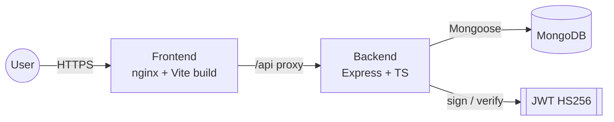

# Leadsrack

> Lead management dashboard for sales teams. MERN + TypeScript, JWT auth, RBAC, Dockerized.

Two-app monorepo built for the **Smart Leads Dashboard** internship assignment. The frontend is a React 19 + Vite + Tailwind dashboard; the backend is an Express 5 + Mongoose + TypeScript API. Both ship Dockerfiles and run together via `docker compose up`.

## Features

- **JWT authentication** — bcrypt-hashed passwords, register/login/me endpoints, protected client routes.
- **Leads CRUD** — name, email, status (`New | Contacted | Qualified | Lost`), source (`Website | Instagram | Referral`), createdAt, ownership tracked by `createdBy`.
- **Composable filters + search + sort + pagination** — all on the server; multiple filters compose; `limit` fixed at 10; response envelope `{ data, meta }`.
- **Debounced search** — 500 ms `useDebounce` before forming the React Query key.
- **CSV export** — `@json2csv/node` AsyncParser; respects the active filters.
- **RBAC** — `admin` sees all leads + the Team page; `sales` users see and act on only their own (enforced in the service layer, not just middleware).
- **View lead details** — Eye-icon action + row-click open a read-only modal; Edit button swaps to the edit form.
- **Responsive shell** — desktop sidebar at lg+, mobile hamburger drawer below.
- **Loading / empty / error states** on every async surface, with a `Skeleton` primitive for placeholder UI.
- **Dark-mode toggle** — Tailwind `darkMode: 'class'`, persisted to `localStorage`, default dark.
- **Dockerized** — three-service compose (mongo + api + web) running on a single network with healthcheck-gated startup.
- **Production-hardened API** — helmet, CORS allowlist, gzip compression, rate-limited auth + writes, request-log redaction, DB-aware health check, graceful SIGTERM shutdown.

Anything beyond this lives in the [Roadmap](#roadmap), not the code.

## Stack

| Layer     | Tech                                                                                                                         |
| --------- | ---------------------------------------------------------------------------------------------------------------------------- |
| Frontend  | React 19, Vite 6, TypeScript 5.8, Tailwind 3, React Router 7, TanStack Query 5, Zustand 5, React Hook Form 7, Zod 4, Sonner  |
| Backend   | Express 5, Mongoose 8, TypeScript 5.9, Zod 3, bcryptjs, jsonwebtoken, Helmet, CORS, express-rate-limit, Pino, @json2csv/node |
| Database  | MongoDB 7                                                                                                                    |
| Tooling   | pnpm 10, Husky 9, Commitlint, lint-staged, Prettier, ESLint 9 flat configs                                                   |
| Container | Multi-stage Dockerfiles (node:22-alpine, nginx:1.27-alpine), docker compose v2                                               |
| CI        | GitHub Actions (lint, typecheck, build per workspace)                                                                        |

## Architecture



Full request pipeline and sequence diagrams: [`ARCHITECTURE.md`](ARCHITECTURE.md).

## Quick start

### Option A — Docker compose (recommended)

```bash
cp .env.example .env
# edit .env: set JWT_SECRET to a long random string (openssl rand -base64 48)
docker compose up --build
```

Then in another terminal:

```bash
docker compose exec api node dist/seed.js
# or run the dev seed inside the api container:
# docker compose exec api sh -c "pnpm exec tsx src/seed.ts"
```

Once the seed prints "seed complete":

- Web: <http://localhost:8080>
- API: <http://localhost:4000/api/health>
- Seeded users: `admin@leadsrack.local` / `admin123!` and `sales@leadsrack.local` / `sales123!`

### Option B — Two terminals (no Docker)

Prerequisites: Node 22 (`nvm use`), pnpm 10, a MongoDB instance (local or Atlas).

```bash
# 1. Root tooling (husky, lint-staged, commitlint)
pnpm install

# 2. Backend
cd Backend
pnpm install
cp .env.example .env   # fill MONGODB_URI + JWT_SECRET
pnpm seed              # idempotent: admin + sales + 25 sample leads
pnpm dev               # http://localhost:4000

# 3. Frontend (new terminal)
cd Frontend
pnpm install
cp .env.example .env   # VITE_API_URL=http://localhost:4000/api
pnpm dev               # http://localhost:3000
```

## Environment variables

| Var                                    | Where    | Required | Default                   | Description                         |
| -------------------------------------- | -------- | -------- | ------------------------- | ----------------------------------- |
| `MONGODB_URI`                          | Backend  | yes      | —                         | Mongo connection string             |
| `JWT_SECRET`                           | Backend  | yes      | —                         | Min 32 chars                        |
| `JWT_EXPIRES_IN`                       | Backend  | no       | `7d`                      | Token lifetime                      |
| `PORT`                                 | Backend  | no       | `4000`                    | HTTP port                           |
| `CORS_ORIGIN`                          | Backend  | no       | `http://localhost:3000`   | Comma-separated allowed origins     |
| `LOG_LEVEL`                            | Backend  | no       | `info`                    | pino level                          |
| `BCRYPT_ROUNDS`                        | Backend  | no       | `10`                      | bcrypt cost factor                  |
| `NODE_ENV`                             | Backend  | no       | `development`             | `development \| test \| production` |
| `VITE_API_URL`                         | Frontend | yes      | —                         | API base URL incl. `/api`           |
| `WEB_PORT` / `API_PORT` / `MONGO_PORT` | Compose  | no       | `8080` / `4000` / `27017` | Host port mappings                  |

Every variable referenced anywhere in code is listed in the corresponding `.env.example`.

## Scripts

### Root

| Script              | Purpose                                |
| ------------------- | -------------------------------------- |
| `pnpm format`       | Prettier-format markdown / JSON / YAML |
| `pnpm format:check` | Prettier check                         |

### Backend

| Script                   | Purpose                    |
| ------------------------ | -------------------------- |
| `pnpm dev`               | tsx watch with auto-reload |
| `pnpm build`             | tsc to `dist/`             |
| `pnpm start`             | run compiled server        |
| `pnpm lint` / `lint:fix` | ESLint                     |
| `pnpm typecheck`         | `tsc --noEmit`             |
| `pnpm seed`              | idempotent seed            |

### Frontend

| Script                   | Purpose                      |
| ------------------------ | ---------------------------- |
| `pnpm dev`               | Vite dev server on :3000     |
| `pnpm build`             | Production bundle to `dist/` |
| `pnpm preview`           | Preview built bundle         |
| `pnpm lint` / `lint:fix` | ESLint                       |
| `pnpm typecheck`         | `tsc --noEmit`               |

## Project structure

```
Leadsrack/
├─ Backend/
│  ├─ src/
│  │  ├─ config/        env (Zod) + db (mongoose connect)
│  │  ├─ controllers/   thin: parse → service → respond
│  │  ├─ lib/           logger, errors, asyncHandler
│  │  ├─ middleware/    auth, requireRole, validate, errorHandler, notFound, rateLimit
│  │  ├─ models/        User, Lead
│  │  ├─ routes/        auth, leads, health, index
│  │  ├─ schemas/       Zod schemas (source of truth for request shapes)
│  │  ├─ services/      auth, leads, csv
│  │  ├─ types/         express.d.ts
│  │  ├─ app.ts
│  │  ├─ seed.ts
│  │  └─ server.ts
│  ├─ Dockerfile        multi-stage, non-root runtime
│  └─ .env.example
├─ Frontend/
│  ├─ src/
│  │  ├─ api/           typed API clients
│  │  ├─ components/    ui/, layout/, dashboard/, feedback/
│  │  ├─ features/      auth/, leads/   (feature-scoped pages + hooks)
│  │  ├─ hooks/         useDebounce
│  │  ├─ lib/           api (axios), env, queryClient, utils
│  │  ├─ pages/         DashboardPage, NotFoundPage
│  │  ├─ routes/        AppRoutes, AppShellLayout, ProtectedRoute
│  │  ├─ store/         authStore, themeStore (zustand)
│  │  ├─ types/         api.ts (mirrors backend Zod shapes)
│  │  ├─ App.tsx        providers + router shell
│  │  └─ main.tsx
│  ├─ Dockerfile        node build → nginx serve
│  ├─ nginx.conf        SPA fallback + /api proxy
│  └─ .env.example
├─ docs/
│  ├─ API.md            endpoint reference + curl examples
│  ├─ SETUP.md          Atlas walkthrough, env setup, compose usage
│  └─ ADRs/             0001..0005
├─ .github/workflows/
│  └─ ci.yml            lint + typecheck + build per workspace
├─ .husky/              pre-commit, commit-msg, pre-push
├─ docker-compose.yml
├─ package.json         root: husky/commitlint/lint-staged/prettier only
└─ README.md            this file
```

## API summary

| Method   | Path                    | Auth                 | Purpose                                                     |
| -------- | ----------------------- | -------------------- | ----------------------------------------------------------- |
| `POST`   | `/api/auth/register`    | public               | Create user (defaults role=sales)                           |
| `POST`   | `/api/auth/login`       | public               | Get JWT                                                     |
| `GET`    | `/api/auth/me`          | bearer               | Current user                                                |
| `GET`    | `/api/leads`            | bearer               | List w/ `?status&source&search&sort&page`                   |
| `POST`   | `/api/leads`            | bearer               | Create                                                      |
| `GET`    | `/api/leads/:id`        | bearer (owner/admin) | Read one                                                    |
| `PATCH`  | `/api/leads/:id`        | bearer (owner/admin) | Update                                                      |
| `DELETE` | `/api/leads/:id`        | bearer (owner/admin) | Delete                                                      |
| `GET`    | `/api/leads/export.csv` | bearer               | Filtered CSV stream                                         |
| `GET`    | `/api/health`           | public               | Liveness + DB readiness (returns 503 if Mongo disconnected) |

Full shapes, status codes, and copy-paste `curl` examples in [`docs/API.md`](docs/API.md).

## Deployment

The project is wired for a one-click split deploy: **Backend → Render**, **Frontend → Vercel**, **DB → MongoDB Atlas**. Infrastructure as Code lives in [`render.yaml`](render.yaml) and [`Frontend/vercel.json`](Frontend/vercel.json).

### 1. Database — MongoDB Atlas (free tier)

1. Create a free cluster at <https://cloud.mongodb.com>.
2. **Database Access** → add a user (e.g. `leadsrack_app`) with a strong password.
3. **Network Access** → allow `0.0.0.0/0` (Render's outbound IPs are dynamic on the free tier).
4. Copy the connection string: `mongodb+srv://<user>:<pass>@<cluster>.mongodb.net/leadsrackDB?retryWrites=true&w=majority`.

### 2. Backend — Render

1. Push this repo to GitHub.
2. Render dashboard → **New → Blueprint → connect this repo**. Render auto-detects `render.yaml` and provisions the `leadsrack-api` service.
3. Set the two `sync: false` env vars in the Render dashboard:
   - `MONGODB_URI` — the Atlas connection string from step 1.
   - `CORS_ORIGIN` — your Vercel URL (set this after step 3; placeholder OK for first deploy).
4. Wait for first deploy to finish. Render auto-generates `JWT_SECRET` via `generateValue: true`.
5. One-time seed (creates admin + sales + 25 sample leads): Render dashboard → **Shell** → `pnpm seed`.
6. Sanity-check: `https://<your-service>.onrender.com/api/health` → `{ "status": "ok", "db": "connected" }`.

### 3. Frontend — Vercel

1. Vercel dashboard → **New Project → Import this repo**.
2. **Root directory**: `Frontend` (Vercel auto-detects Vite via `vercel.json`).
3. **Environment variables**: `VITE_API_URL = https://<your-render-service>.onrender.com/api`
4. Deploy. The SPA rewrite in `vercel.json` ensures hard-refresh on `/leads` or `/team` doesn't 404.
5. Once Vercel assigns the URL (e.g. `https://leadsrack.vercel.app`), go back to Render and update `CORS_ORIGIN` to it, then trigger a redeploy.

### Notes

- **Render free tier sleeps after 15 min idle.** First request after sleep takes ~30 s. Paid tier ($7/mo) removes this.
- **Vercel preview URLs** won't pass CORS by default. Either set `CORS_ORIGIN` to a comma-separated list including the preview domain pattern, or stick to production-only deploys.
- **Atlas free tier (M0)** caps at 512 MB — more than enough for this dataset.
- `BCRYPT_ROUNDS=12` in production (set in `render.yaml`); local dev uses `10` for fast iteration.

Full backend env reference: [`Backend/.env.example`](Backend/.env.example).

## Roadmap

Out of scope for the assignment, captured here for transparency:

- Password reset + email verification (would also bring [`EMAIL`](docs/ADRs/) into the stack).
- Refresh tokens + httpOnly cookies (currently JWT in localStorage — see [ADR 0005](docs/ADRs/0005-token-in-localstorage.md)).
- Multi-tenant org partitioning.
- Audit log per write operation.
- Real-time lead updates via WebSockets.
- File attachments on leads (would bring `FILE_STORAGE` into the stack).
- Shared `packages/shared` for Zod schemas to eliminate manual type mirroring (see [ADR 0001](docs/ADRs/0001-no-monorepo-tooling.md)).

## Contributing

See [`CONTRIBUTING.md`](CONTRIBUTING.md). TL;DR: Conventional Commits, husky runs lint-staged on pre-commit, `pnpm lint && pnpm typecheck && pnpm build` must pass before pushing.

## License

[MIT](LICENSE).

## Contact

Maintainer: aaditya09750 — <aadigunjal0975@gmail.com>
