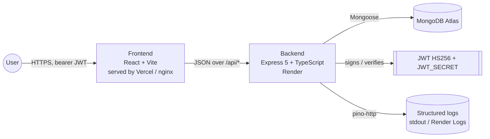

<!-- markdownlint-disable MD013 MD033 -->

# Leadsrack

Lead management dashboard for sales teams with role-based pipelines, server-side filtering, debounced search, CSV export, and a production-hardened API.

[](#tech-stack)
[](#tech-stack)
[](#tech-stack)
[](#tech-stack)
[](#quick-start)
[](#tech-stack)
[](#tech-stack)
[](#tech-stack)
[](LICENSE)
[](#roadmap)

## Overview

Leadsrack is a focused lead management MVP built for the **Smart Leads Dashboard** internship assignment. Sales users create and track leads through a four-stage pipeline (`New → Contacted → Qualified → Lost`); admins get a Team page that aggregates lead counts per user with drill-in to any sales rep's pipeline. The API enforces ownership in the service layer, paginates 10 leads at a time, streams CSV exports, and ships with a DB-aware health check, gzip compression, and JWT log redaction. The frontend is a Tailwind-styled SPA with dark-mode, mobile drawer navigation, table-to-card layouts under 768 px, and ECharts widgets on the analytics dashboard.

## Problem statement

Most generic admin templates skip the actual sales workflow: ownership, role-scoped lists, multi-filter composition, paginated bulk export, and an admin "by-user" view. Leadsrack models that workflow directly — JWT authentication with bcrypt, role-based access control where the service layer is the security boundary (not just middleware), server-side `?status&source&search&sort&page` filters that compose with AND semantics, debounced search that skips empty queries, and a CSV export that respects the active filter set. The result is a small, opinionated codebase that's easier to extend than a CMS plugin trail.

## Live demo

| Item                | Link                                                             |
| ------------------- | ---------------------------------------------------------------- |
| Frontend (Vercel)   | <!-- TODO: paste Vercel URL after first deploy -->               |
| API health (Render) | <!-- TODO: paste Render URL + /api/health after first deploy --> |
| Source              | <https://github.com/aaditya09750/Leadsrack>                      |

> **Cold-start note** — Render's free tier sleeps after 15 minutes of inactivity. First request after sleep takes ~30 s while the dyno wakes; subsequent calls are instant.

## Core features

### Sales user

- Sign up / log in with bcrypt-hashed password; receive a 7-day JWT.
- Create, view, edit, and delete leads scoped to their own ownership.
- Read-only **lead detail modal** via Eye-icon action or row click; Edit button swaps to the edit form.
- Compose filters: status × source × full-text search × latest/oldest sort, all server-side.
- Debounced search (500 ms) with whitespace-trim so empty queries don't hit the API.
- Export filtered leads as CSV — server uses `@json2csv/node` AsyncParser; the filename is timestamped.
- Mobile-first UI: hamburger nav drawer, table-to-card layout below `md`, half-width filter selects.

### Admin

- Everything a sales user has, with no ownership scoping (sees all leads).
- **Team page** (`/team`) — KPI tiles + members table with per-user lead counts bucketed by status; click any row to drill into `/leads?owner=<email>`.
- Owner filter in the leads page (admin-only dropdown) and a dismissable owner-chip in the URL.
- Admin route guard (`AdminRoute`) at the client; backend's `requireRole('admin')` is the real boundary.

### Platform

- Custom JWT auth (HS256) with `JWT_SECRET ≥ 32 chars` enforced by Zod env validation.
- RBAC: `requireAuth` → `requireRole(...)` → service-layer ownership checks.
- Centralized error handler emitting `{ error: { code, message, details? } }` envelopes.
- Request validation via Zod schemas (the source of truth for body/query/params shapes).
- Rate limiters: 20 req / 15 min on `/auth`, 60 req / min on lead writes.
- Helmet headers, CORS allowlist (comma-separated origins), gzip compression, `trust proxy: 1`.
- pino-http access logs with redaction of `Authorization` / `Cookie` headers.
- DB-aware health check (`GET /api/health` returns 503 when Mongo disconnected) for orchestrator probes.
- Graceful shutdown on SIGTERM/SIGINT (10 s force-exit fallback).
- Dashboard read-API: KPIs, ECharts series, traffic aggregates (website / device / location / marketing), activities feed, contacts, and notifications — all surfaced in the right drawer.
- Light + dark mode with persisted preference and CSS-variable theming.

## Tech stack

| Layer     | Tech                  | Version                           | Purpose                                                   |
| --------- | --------------------- | --------------------------------- | --------------------------------------------------------- |
| Frontend  | React                 | 19.1.x                            | UI rendering and component model                          |
| Frontend  | Vite                  | 6.x                               | Dev server and production build                           |
| Frontend  | TypeScript            | 5.8.x                             | Strict typing across the SPA                              |
| Frontend  | Tailwind CSS          | 3.4.x                             | Utility-first styling with CSS-var tokens for theme       |
| Frontend  | React Router          | 7.x                               | Client-side routing with nested layouts + route guards    |
| Frontend  | TanStack Query        | 5.x                               | Server-state caching + invalidation                       |
| Frontend  | Zustand               | 5.x                               | Local-state stores (`authStore`, `themeStore`, `uiStore`) |
| Frontend  | React Hook Form + Zod | 7.x + 4.x                         | Form state + schema validation                            |
| Frontend  | ECharts (react)       | 6.x                               | Dashboard charts (line / bar / donut)                     |
| Frontend  | Framer Motion         | 12.x                              | Drawer animations                                         |
| Frontend  | Axios                 | 1.x                               | HTTP client with bearer interceptor                       |
| Frontend  | Sonner                | 2.x                               | Toast notifications                                       |
| Backend   | Node.js               | 22+                               | Runtime                                                   |
| Backend   | Express               | 5.x                               | HTTP server                                               |
| Backend   | TypeScript            | 5.9.x                             | Strict typing in the API                                  |
| Backend   | Mongoose              | 8.x                               | MongoDB ODM                                               |
| Backend   | Zod                   | 3.x                               | Env + request validation                                  |
| Backend   | bcryptjs              | 2.x                               | Password hashing (pure JS for Docker portability)         |
| Backend   | jsonwebtoken          | 9.x                               | HS256 JWT signing / verifying                             |
| Backend   | Helmet                | 8.x                               | Security headers                                          |
| Backend   | compression           | 1.x                               | gzip / deflate responses                                  |
| Backend   | express-rate-limit    | 7.x                               | Per-IP rate limiting                                      |
| Backend   | pino + pino-http      | 9.x + 10.x                        | Structured logging with redaction                         |
| Backend   | @json2csv/node        | 7.x                               | CSV export via AsyncParser                                |
| Database  | MongoDB Atlas         | 7.x (managed)                     | `leadsrackDB`                                             |
| Tooling   | pnpm                  | 10.x                              | Package manager (per-app lockfiles)                       |
| Tooling   | Husky + lint-staged   | 9.x + 16.x                        | Pre-commit / commit-msg / pre-push hooks                  |
| Tooling   | Commitlint            | 19.x                              | Conventional Commits enforcement                          |
| Tooling   | ESLint 9 + Prettier   | flat config + 3.x                 | Lint + format                                             |
| Container | Docker (multi-stage)  | node:22-alpine, nginx:1.27-alpine | `web`, `api`, `mongo` services                            |
| CI        | GitHub Actions        | —                                 | Lint + typecheck + build per workspace                    |

## Architecture at a glance



Three runtime services in the Docker compose stack (`web` + `api` + `mongo`); production splits them across Vercel (web) + Render (api) + Atlas (db). See [ARCHITECTURE.md](ARCHITECTURE.md) for the request pipeline, sequence diagrams, and the ERD.

## Quick start

### Prerequisites

- Node.js 22+
- pnpm 10+ (`corepack enable && corepack prepare pnpm@latest --activate`)
- A MongoDB instance (local on `:27017` or an Atlas cluster)
- Docker + Docker Compose (optional, for the bundled stack)

### Option A — Docker Compose (recommended for first-clone)

```bash
cp .env.example .env
# Edit .env: set JWT_SECRET to a long random string (openssl rand -base64 48)
docker compose up --build
```

Then seed inside the running `api` container:

```bash
docker compose exec api node dist/seed.js
```

URLs:

- Web: <http://localhost:8080>
- API health: <http://localhost:4000/api/health>

### Option B — Two terminals (no Docker)

```bash
# Repo root: install dev tooling (husky, lint-staged, commitlint, prettier)
pnpm install

# Backend (terminal 1)
cd Backend
pnpm install
cp .env.example .env       # fill MONGODB_URI + JWT_SECRET (>= 32 chars)
pnpm seed                  # idempotent: 3 users + 25 leads + dashboard data
pnpm dev                   # http://localhost:4000

# Frontend (terminal 2)
cd Frontend
pnpm install
cp .env.example .env       # VITE_API_URL=http://localhost:4000/api
pnpm dev                   # http://localhost:3000
```

### Seeded credentials

| Role  | Email                      | Password      |
| ----- | -------------------------- | ------------- |
| admin | `admin@leadsrack.local`    | `admin123!`   |
| sales | `sales@leadsrack.local`    | `sales123!`   |
| sales | `aadigunjal0975@gmail.com` | `aaditya123!` |

> Change these in production. They exist only to give a fresh-clone reviewer something to log in with.

For an end-to-end third-party setup walkthrough (Atlas cluster, JWT secret generation, troubleshooting), see [docs/SETUP.md](docs/SETUP.md).

## Environment variables

### Backend (`Backend/.env`)

| Variable         | Required | Default                 | Source                                           | Purpose                               |
| ---------------- | -------- | ----------------------- | ------------------------------------------------ | ------------------------------------- |
| `MONGODB_URI`    | Yes      | —                       | [config/env.ts](Backend/src/config/env.ts)       | MongoDB connection string             |
| `JWT_SECRET`     | Yes      | —                       | [config/env.ts](Backend/src/config/env.ts)       | HS256 signing key, **min 32 chars**   |
| `JWT_EXPIRES_IN` | No       | `7d`                    | [services/auth.ts](Backend/src/services/auth.ts) | Token lifetime (`7d`, `12h`, seconds) |
| `CORS_ORIGIN`    | No       | `http://localhost:3000` | [app.ts](Backend/src/app.ts)                     | Comma-separated origin allowlist      |
| `PORT`           | No       | `4000`                  | [server.ts](Backend/src/server.ts)               | HTTP port; Render injects this        |
| `LOG_LEVEL`      | No       | `info`                  | [lib/logger.ts](Backend/src/lib/logger.ts)       | pino level (`fatal`..`trace`)         |
| `BCRYPT_ROUNDS`  | No       | `10`                    | [config/env.ts](Backend/src/config/env.ts)       | Hashing cost; use `12` in production  |
| `NODE_ENV`       | No       | `development`           | —                                                | `development \| test \| production`   |

### Frontend (`Frontend/.env`)

| Variable       | Required | Default | Source                                | Purpose                   |
| -------------- | -------- | ------- | ------------------------------------- | ------------------------- |
| `VITE_API_URL` | Yes      | —       | [lib/env.ts](Frontend/src/lib/env.ts) | API base URL incl. `/api` |

### Docker Compose host ports (root `.env`)

| Variable     | Default | Purpose                 |
| ------------ | ------- | ----------------------- |
| `WEB_PORT`   | `8080`  | nginx-served web bundle |
| `API_PORT`   | `4000`  | API host port           |
| `MONGO_PORT` | `27017` | Mongo host port         |

Every variable referenced in code is documented in the matching `.env.example`.

## Available scripts

### Root tooling

| Script              | Purpose                                             |
| ------------------- | --------------------------------------------------- |
| `pnpm format`       | Prettier-format `*.md`, `*.json`, `*.yaml`, `*.yml` |
| `pnpm format:check` | Verify Prettier formatting without writing          |

### `Backend/`

| Script                   | Purpose                                                 |
| ------------------------ | ------------------------------------------------------- |
| `pnpm dev`               | tsx watch with auto-reload (http://localhost:4000)      |
| `pnpm build`             | `tsc -p tsconfig.json` → `dist/`                        |
| `pnpm start`             | `node dist/server.js` (production entry)                |
| `pnpm seed`              | Idempotent: ensures 3 users + 25 leads + dashboard data |
| `pnpm lint` / `lint:fix` | ESLint (`--max-warnings=0` in CI)                       |
| `pnpm typecheck`         | `tsc --noEmit`                                          |

### `Frontend/`

| Script                   | Purpose                                   |
| ------------------------ | ----------------------------------------- |
| `pnpm dev`               | Vite dev server on :3000                  |
| `pnpm build`             | Production bundle to `dist/`              |
| `pnpm preview`           | Preview the built bundle                  |
| `pnpm lint` / `lint:fix` | ESLint                                    |
| `pnpm typecheck`         | `tsc --noEmit` (uses `tsconfig.app.json`) |

## Quality tooling

| Tool               | Purpose                                                                  |
| ------------------ | ------------------------------------------------------------------------ |
| ESLint flat config | React/Vite rules on the client; Node/Express rules on the API            |
| Prettier           | Format `.md`, `.json`, `.yaml`, `.yml` (root); ESLint handles `.ts/.tsx` |
| Husky              | Git hooks orchestrator                                                   |
| lint-staged        | Run eslint --fix + prettier only on staged files                         |
| Commitlint         | Enforces Conventional Commits (`feat`, `fix`, `chore`, etc.)             |
| GitHub Actions     | Per-workspace lint + typecheck + build on PRs and pushes to `main`       |

Hook behavior:

- **pre-commit** — lint-staged on staged files only
- **commit-msg** — commitlint (max header 100 chars)
- **pre-push** — full lint + typecheck + build on both workspaces

## Project structure

```text
Leadsrack/
├─ Backend/
│  ├─ src/
│  │  ├─ config/          env.ts (Zod-validated) + db.ts (Mongoose connect)
│  │  ├─ controllers/     Thin: parse → call service → respond
│  │  ├─ data/            dashboardSeed.ts (reference data)
│  │  ├─ lib/             logger (pino), errors (AppError), asyncHandler
│  │  ├─ middleware/      auth, requireRole, validate, errorHandler, notFound, rateLimit
│  │  ├─ models/          User, Lead, DashboardKpi, ChartSeries, TrafficAggregate,
│  │  │                   Activity, Contact, Notification (8 schemas)
│  │  ├─ routes/          auth, leads, team, dashboard, activities, contacts,
│  │  │                   notifications, health, index
│  │  ├─ schemas/         Zod schemas (source of truth for request shapes)
│  │  ├─ services/        auth, leads, team, csv (business logic)
│  │  ├─ types/           express.d.ts (req.user augmentation)
│  │  ├─ app.ts           Middleware stack
│  │  ├─ seed.ts          Idempotent seed (find-or-create users)
│  │  └─ server.ts        Bootstrap + graceful shutdown
│  ├─ Dockerfile          Multi-stage, non-root runtime
│  └─ .env.example
├─ Frontend/
│  ├─ src/
│  │  ├─ api/             Typed clients: leads, team, dashboard, auth
│  │  ├─ components/      ui/, layout/, dashboard/, feedback/
│  │  ├─ data/            dashboardData.ts (offline fallback for widgets)
│  │  ├─ features/        auth/, leads/, team/, dashboard/ (feature folders)
│  │  ├─ hooks/           useDebounce
│  │  ├─ lib/             api (axios), env, queryClient, colors, time, utils
│  │  ├─ pages/           DashboardPage, NotFoundPage
│  │  ├─ routes/          AppRoutes, AppShellLayout, ProtectedRoute, AdminRoute
│  │  ├─ store/           authStore, themeStore, uiStore (zustand)
│  │  ├─ types/           api.ts, dashboard.ts, team.ts (mirror Zod shapes)
│  │  ├─ App.tsx          Providers + router shell
│  │  └─ main.tsx
│  ├─ Dockerfile          Node build → nginx serve
│  ├─ nginx.conf          SPA fallback + /api proxy
│  ├─ vercel.json         SPA rewrites + asset cache headers
│  └─ .env.example
├─ docs/
│  ├─ API.md              Full endpoint reference + curl examples
│  ├─ SETUP.md            Atlas + Render + Vercel walkthrough
│  └─ ADRs/               Architecture Decision Records (0001..0005)
├─ .github/
│  ├─ ISSUE_TEMPLATE/
│  ├─ workflows/ci.yml
│  └─ PULL_REQUEST_TEMPLATE.md
├─ .husky/                pre-commit, commit-msg, pre-push
├─ docker-compose.yml
├─ render.yaml            Render Blueprint (api service IaC)
├─ AGENTS.md              AI-agent path map (compat with Claude/Cursor/Copilot/Windsurf)
├─ ARCHITECTURE.md
├─ CONTRIBUTING.md
├─ CODE_OF_CONDUCT.md
├─ SECURITY.md
├─ LICENSE
├─ package.json           Root: husky + commitlint + lint-staged + prettier
└─ README.md              This file
```

## API reference

Base URL: `<VITE_API_URL>` (commonly `http://localhost:4000/api` in dev, `<render-url>/api` in prod).
Protected routes expect `Authorization: Bearer <jwt>`.

| Method   | Path                  | Auth                 | Purpose                                             |
| -------- | --------------------- | -------------------- | --------------------------------------------------- |
| `GET`    | `/health`             | Public               | DB-aware liveness probe (503 if Mongo disconnected) |
| `POST`   | `/auth/register`      | Public               | Create user (defaults `role=sales`)                 |
| `POST`   | `/auth/login`         | Public               | Exchange credentials for JWT                        |
| `GET`    | `/auth/me`            | Bearer               | Current user                                        |
| `GET`    | `/leads`              | Bearer               | List with `?status&source&search&sort&page&owner`   |
| `POST`   | `/leads`              | Bearer               | Create lead                                         |
| `GET`    | `/leads/:id`          | Bearer (owner/admin) | Read one                                            |
| `PATCH`  | `/leads/:id`          | Bearer (owner/admin) | Update                                              |
| `DELETE` | `/leads/:id`          | Bearer (owner/admin) | Delete                                              |
| `GET`    | `/leads/export.csv`   | Bearer               | Filtered CSV stream                                 |
| `GET`    | `/team`               | Bearer + admin       | Members table + summary KPIs                        |
| `GET`    | `/dashboard/overview` | Bearer               | KPIs + chart series + 4 traffic aggregates          |
| `GET`    | `/activities`         | Bearer               | 20 most recent activities                           |
| `GET`    | `/contacts`           | Bearer               | Contacts list (alphabetical)                        |
| `GET`    | `/notifications`      | Bearer               | Role-scoped notifications (admin/sales/all)         |

Full request/response shapes, error codes, and copy-paste curl: [docs/API.md](docs/API.md).

## Deployment

Production is split across **Render (API)**, **Vercel (web)**, and **MongoDB Atlas (DB)**. IaC files live in [render.yaml](render.yaml) and [Frontend/vercel.json](Frontend/vercel.json).

### 1. Database — MongoDB Atlas

1. Create a free cluster at <https://cloud.mongodb.com>.
2. **Database Access** → add a SCRAM user.
3. **Network Access** → allow `0.0.0.0/0` (Render's outbound IPs are dynamic on free tier).
4. Copy the connection string `mongodb+srv://<user>:<pass>@<cluster>.mongodb.net/leadsrackDB?retryWrites=true&w=majority`.

### 2. API — Render Blueprint

1. Push to GitHub. Render → **New → Blueprint → connect repo**. Auto-detects `render.yaml`.
2. Set the two `sync: false` env vars in the dashboard:
   - `MONGODB_URI` — Atlas connection string from step 1.
   - `CORS_ORIGIN` — your Vercel URL (set after step 3; placeholder OK for first deploy).
3. Render auto-generates `JWT_SECRET` (`generateValue: true`).
4. One-time seed: dashboard → **Shell** → `pnpm seed`.
5. Sanity-check: `https://<service>.onrender.com/api/health` → `{ "status": "ok", "db": "connected" }`.

### 3. Web — Vercel

1. Vercel → **New Project → Import repo**. Root directory = `Frontend`.
2. Set `VITE_API_URL = https://<render-service>.onrender.com/api`.
3. Deploy. The SPA rewrite in `vercel.json` handles client-side routing.
4. Update Render's `CORS_ORIGIN` to your Vercel URL and redeploy the API.

### Webhook gotchas

- **First request after sleep takes ~30 s** on Render free tier — document this for reviewers.
- **CORS_ORIGIN must be the exact Vercel URL** (no trailing slash). For preview URLs, use a comma-separated list.
- **Atlas free tier (M0)** caps at 512 MB — fine for this dataset.

## Scalability considerations

- The API is **stateless** — JWTs in headers, no in-memory session. Horizontal scaling behind a load balancer requires only shared Mongo + a shared rate-limit store (e.g. Redis) for multi-instance throughput limits.
- **MongoDB indexes** already cover the hot query paths: `Lead.{createdBy:1, createdAt:-1}` for sales-user lists, single-field indexes on `status` and `source` for filter selectivity, and a `User.email` unique index. Add a compound `{ createdBy, status }` if status-faceted queries become hot.
- **CSV export** currently loads results into memory via `Lead.find().lean()` + `@json2csv/node` AsyncParser. Bound by `find()`; for unbounded exports, switch to `cursor()` + stream Transform.
- **Auth rate limiting** uses an in-memory store. For multi-dyno deployments, move to `rate-limit-redis`.
- **Dashboard read-API** is denormalized into 6 reference collections (KPIs, chart series, traffic aggregates, activities, contacts, notifications) so a single `/dashboard/overview` call returns everything in one round-trip.
- **Logger redaction** strips `Authorization` / `Cookie` headers before pino's aggregator sees them — safe to ship logs to Render / Datadog / Loki.

## Roadmap

- **Refresh tokens + httpOnly cookies** to remove the XSS-exposed `localStorage` JWT ([ADR 0005](docs/ADRs/0005-token-in-localstorage.md)).
- **Shared `packages/shared`** for Zod schemas + inferred types to eliminate the Backend↔Frontend type mirror ([ADR 0001](docs/ADRs/0001-no-monorepo-tooling.md)).
- **Tests** — Vitest in both workspaces; smoke tests for auth + leads CRUD + RBAC paths.
- **Sentry + OpenTelemetry** hooks at the error handler and pino transport.
- **CSV export → background job** (BullMQ + Redis) for unbounded exports.
- **Manual chunks** (`echarts` → separate vendor bundle) to bring the frontend gzip from 593 KB to ~300 KB.
- **Email verification + password reset** flow.
- **Audit log** per write operation.

## Help wanted

- A fresh onboarding pass — confirm README + [docs/SETUP.md](docs/SETUP.md) is enough to go from clone → working local stack → seeded data → logged in.
- Good first issues: tests for `services/leads.ts` and `services/team.ts`, hardening the rate-limit store, bundling EChars as a vendor chunk.

## Contributing

Contributions welcome. Start with [CONTRIBUTING.md](CONTRIBUTING.md), follow the [Code of Conduct](CODE_OF_CONDUCT.md), and keep feature claims grounded in code that exists. Conventional Commits are enforced by the `commit-msg` hook; bypass (`--no-verify`) is not a normal workflow.

## Security

Report vulnerabilities privately per [SECURITY.md](SECURITY.md). Known security boundaries:

- `requireRole('admin')` is the authoritative admin check — the frontend `AdminRoute` is UX only.
- Ownership for leads is enforced in `services/leads.ts` (not at the route level).
- Rate limits gate `/auth` (20/15min) and lead writes (60/min).
- Logger redacts `Authorization` and `Cookie` headers.
- See [ADR 0005](docs/ADRs/0005-token-in-localstorage.md) for the JWT-in-localStorage trade-off.

## License

Released under the [MIT License](LICENSE).

## Acknowledgements / contact

Built by **Aaditya Gunjal** as a full-stack lead management MVP for the Smart Leads Dashboard internship assignment.

- GitHub: <https://github.com/aaditya09750>
- Email: <aadigunjal0975@gmail.com>
